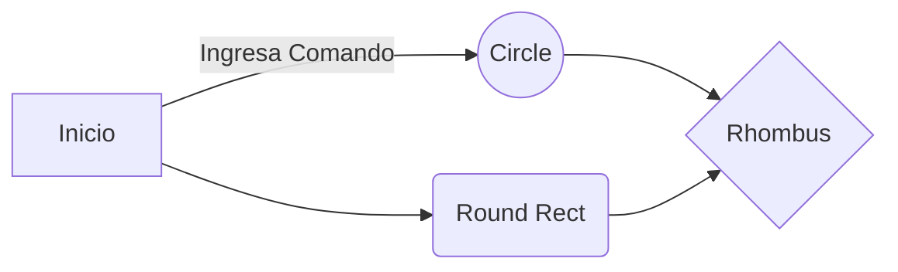

# SimpleSQL - Ayuda

SimpleSQL es una aplicación para consola desarrollada en Python que soporta comandos de SQL. No todos. Los que soporta están descrito abajo.
No posee un manejador de Base de Datos sino que permite cargar archivos a memoria y sobre ellos realizar consultas, selects, max, min, conteo de registros y un reporte.

# Cargar

Sintáxis: Cargar <archivo1.json>, <archivo2.json>, ...

Abre cada uno de los archivos listados, deben ir separados por comas, verifica que el archivo exista, de lo contrario intenta cargar el siguiente, hasta terminar con la lista de archivos. Al cargar cada archivo emite  un mensaje en consola de que el archivo fue cargado. El formato de los archivos es .JSON y la estructura debe ser esta:
[  
    {  
        "nombre": "registro 1",  
  "edad": 45,  
  "activo": true,  
  "promedio": 56.456  
  },  
  {  
        "nombre": "registro 2",  
  "edad": 35,  
  "activo": false,  
  "promedio": 45.896  
  }  
]

## Seleccionar

Sintáxis: Seleccionar <*>/<atributo> 

Permite seleccionar los registros cargados a memoria listando cada atributo o con un * para mostrar todos los atributos.

## Maximo

Sintáxis: Maximo <edad> / <promedio>

Despliega el mayor  valor del atributo seleccionado de entre todos los registros cargados a memoria.

## Minimo

Sintáxis: Minimo <edad> / <promedio>

Despliega el valor menor del atributo seleccionado de entre todos los registros cargados a memoria.

## Suma

Sintáxis: Suma <edad>/<promedio>

Realiza la suma de los valores del atributo elegido para todos los registros cargados a memoria.

## Cuenta

Sintáxis: Cuenta 

Realiza un conteo de cuántos registros fueron cargados a memoria y despliega ese valor.

## Reportar

Sintáxis: Reportar <N>

Crea un reporte HTML y lo abre en el explorador con el número N de registros indicados en el comando.

# Manual Técnico

Diagráma de Flujo del Programa

